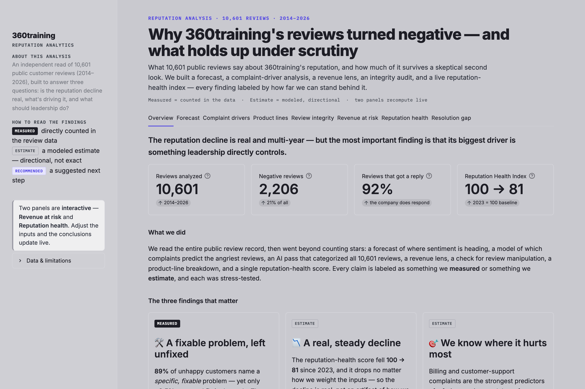
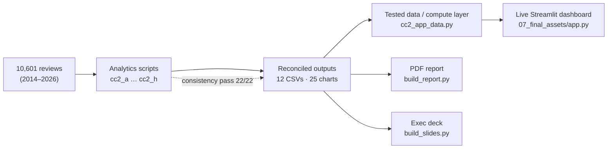

# 360training Reputation Intelligence

**Why a compliance-training company's customer sentiment declined from 2024 — and what leadership should do — read from 10,601 public reviews.** A live dashboard, a PDF report, and an exec deck, all driven by one reconciled analytics layer.

[](https://360training-reputation.streamlit.app)


> [!NOTE]
> **Posture: calibrated honesty over sophistication.** Every claim is labelled **Measured** (counted in the data), **Estimate** (modelled, directional), or **Recommended** (a suggested action) — with the caveat that matters. Nothing is dressed up beyond what the data supports. Built as a Head-of-Analytics interview portfolio piece.

**▶ Live demo: [360training-reputation.streamlit.app](https://360training-reputation.streamlit.app)** — deployment details in **[`DEPLOY.md`](DEPLOY.md)**.

[](https://360training-reputation.streamlit.app)

---

## What this is

An independent read of **every public Trustpilot review of 360training** (10,601 reviews, 2014–2026) that goes past counting stars to answer three questions a CEO would ask:

1. **Is the reputation decline real?** — yes, and it's multi-year.
2. **What's driving it?** — billing/support complaints, and a striking failure to *resolve* fixable issues.
3. **What should leadership do?** — close the resolution gap; investigate the safety-training line; provide one internal series to harden the revenue case.

The deliverable is three artefacts off one backbone: a **live Streamlit dashboard**, a **PDF report**, and an **editable exec deck** — every figure in all three reconciles to a single source.

## Key findings

| Finding | | Detail |
|---|---|---|
| **A fixable problem, left unfixed** | `Measured` | 88.5% of negative reviews name a *fixable* issue, yet a company reply offers a specific remedy in only **11 of 2,206 (~0.5%)** — a **178× drop-off** (stress-tested against the raw reply text; a conservative upper bound). Replies to unhappy customers are **73% "email-us" deflection**. |
| **A real, multi-year decline** | `Estimate` | A composite Reputation Health score (2023 = 100) falls **100 → 93.6 → 86.0 → 80.6**, and it drops under *all nine* component weightings — the trend is in the data, not the method. |
| **Honest forecast, not false confidence** | `Measured` | Over **53 held-out forecasts** the 80%/95% ranges held **79%/96%** of the time. The trend sign is *deliberately* left uncertain — negativity is elevated and noisy ~32%, off a ~47% peak but above the ~18% pre-2024 baseline. |
| **Where the anger comes from** | `Estimate` | Billing/refund complaints carry **~10×** and support **~4.6×** the odds of a 1-star review (caveat: keyword themes flag ~58% of negatives). |
| **Where trust is bleeding fastest** | `Estimate` | Safety-training negativity **tripled** — 24% → 47% → 78% (2023→25, annual n = 78/66/50). Real estate is the chronically angriest line (~64%). |
| **A deliberate null** | `Measured` | Some reviews allege fake 5-star batches; tested rigorously, first-time-reviewer share stays flat every year — **no manipulation signature**. Reported as an audit, not an accusation. |

## The dashboard

Eight tabs, two of them interactive:

| Tab | What it shows |
|---|---|
| **Overview** | KPI cards + the three findings a CEO should leave with |
| **Forecast** | 6-month negative-share outlook; calibration, not a point prediction |
| **Complaint drivers** | which themes predict a 1-star review (odds ratios) |
| **Product lines** | the safety-training triple + the product-line heatmap |
| **Review integrity** | the deliberate null — audit, not accusation |
| **Revenue at risk** 🔬 | **live break-even** — drop in your own numbers, watch the threshold move |
| **Reputation health** 🔬 | **live re-weighting** — drag the component weights, watch the decline hold |
| **Resolution gap** | the 178× funnel — the most actionable finding |

> [!TIP]
> The two interactive panels recompute from the **same code** that produced the static charts (the break-even formula and the reputation-health weighting are imported, not re-implemented), so a slider can never contradict a published exhibit. With the default weights the live index reproduces the published one exactly.

## Architecture



The analytics scripts write reconciled CSVs and charts. The **tested data layer** (`cc2_app_data.py`) is the single spine the app reads from — and the app's two live widgets import their formulas straight from the analysis code, so the interactive and static views can't drift apart.

## Dataset

- **Source:** public Trustpilot reviews of 360training — **10,601** records, **2014-07 → 2026-06** (partial final month excluded).
- **Shape:** 2,206 negative (≤2★, 20.8%); 91.5% have a company reply; star distribution is bimodal.
- **Enrichment:** all 10,601 reviews were typed into 19 structured fields by an LLM (Haiku 4.5, forced schema, Batch API, $21.74, 0 errors).

> [!IMPORTANT]
> The confidential raw data and due-diligence material are **excluded from this repo** (`00_source_materials/` is git-ignored). The app reads only small, aggregate outputs (12 CSVs + chart images) — which is why this repo can be **public** (required for Streamlit's free hosting) without exposing any source data.

## Methodology

Eight analysis workstreams, each labelled by how far it can be trusted:

- **Forecast** — a local-level state-space model on the monthly negative share, validated by rolling-origin backtest (calibration, not point accuracy).
- **Drivers** — logistic-regression odds ratios with bootstrap CIs; a 1★-vs-2★ conditional model to separate operational signal from "angry words in angry reviews."
- **Structured extraction** — all reviews categorised into 19 fields; validation is *model-vs-model agreement* (consistency), **not** human-certified accuracy — so dependent upgrades stay conservative.
- **Revenue** — a **break-even inversion** (the fix pays for itself above a small conversion lift) that needs no borrowed elasticity; a dollar range is demoted to an appendix.
- **Integrity** — a pre-registered anomaly battery with FDR control; the headline result is a *null*.
- **Segmentation** — product-line negative share at the grain where the sample size supports it.
- **Reputation Health Index** — a composite of complaint volume, severity, and reply operations, frozen to a 2023 baseline, with a 9-configuration robustness panel.

## Run it locally

```bash
git clone https://github.com/LCS-Adam/360training-reputation-app.git
cd 360training-reputation-app

python3 -m venv .venv
./.venv/bin/pip install -r requirements.txt

# launch the dashboard (run from the repo root so data paths resolve)
./.venv/bin/streamlit run 07_final_assets/app.py
```

Then open the URL Streamlit prints (default <http://localhost:8501>).

> On Windows, swap the Unix venv paths for `.venv\Scripts\` — e.g. `.venv\Scripts\streamlit run 07_final_assets\app.py`.

**Verify the numbers without the UI** — the app is a thin view over a tested data layer:

```bash
./.venv/bin/python cc2_app_data.py     # 9/9 substance checks (coverage, break-even, RHI, …)
```

These confirm the figures are **internally reconciled and the formulas behave** — not that they're externally certified against ground truth (see [*What this data cannot support*](#what-this-data-cannot-support)).

## Reproduce the analysis

```bash
# regenerate every chart + CSV (writes to 01_analytics_outputs/)
for s in cc2_b_drivers cc2_g_segmentation cc2_f_integrity cc2_a_forecast \
         cc2_d_revenue cc2_c_resolution_gap cc2_h_kpi; do ./.venv/bin/python $s.py; done

./.venv/bin/python cc2_consistency.py   # cross-workstream reconciliation → 22/22, 0 conflicts
./.venv/bin/python build_report.py      # → 07_final_assets/360training_Analytics_Report.pdf
./.venv/bin/python build_slides.py      # → 07_final_assets/360training_Exec_Deck.pptx
```

> [!NOTE]
> Two scripts sit **outside** the loop above: `cc2_c_extract.py` (the LLM extraction — it calls the Anthropic Batch API and reads a key from `~/.config/anthropic.env`; outputs already committed) and `cc2_e_topics.py` (an optional topic-model cross-check). You don't need either to run the app or rebuild the report.

## What this data *cannot* support

The honesty layer — stated up front, true of every figure:

- **Who posts, not everyone** — reviews can't be split into invited vs. organic, so every rate is conditional on who chose to post (this caps the integrity audit).
- **Small monthly samples** — ~50–90 reviews/month after 2024, so month-to-month moves under ~5–7 points are noise.
- **Two different lenses** — the forecast tracks ≤2★ reviews; the driver model tracks 1★ reviews — different populations, stated side by side.
- **The auto-tagging is model-generated** — validated for *consistency*, not certified for accuracy; the precision-gated upgrades were deliberately left conservative.

## Deploy

A permanent public URL (e.g. Streamlit Community Cloud) takes ~3 minutes. Full steps — plus an instant-tunnel option and a Hugging Face alternative — are in **[`DEPLOY.md`](DEPLOY.md)**.

## Repository map

<details>
<summary>Files & folders</summary>

```text
├── 07_final_assets/
│   ├── app.py                  # the live Streamlit dashboard (entry point)
│   └── README.md               # run/verify quick reference
├── cc2_app_data.py             # tested data/compute layer the app reads from
├── cc2_common.py               # shared loader + chart style
├── cc2_a_forecast.py … cc2_h_kpi.py   # the analytics workstreams
├── cc2_consistency.py          # cross-workstream reconciliation (22/22)
├── build_report.py             # PDF report builder (reportlab)
├── build_slides.py             # exec deck builder (python-pptx)
├── 01_analytics_outputs/     # reconciled CSVs + CC2_chart_pack/ (25 charts)
├── .streamlit/config.toml      # the dashboard theme
├── fonts/                      # IBM Plex Mono (embedded in the PDF)
├── requirements.txt            # app runtime deps
└── DEPLOY.md                   # publishing guide
   (00_source_materials/ — confidential raw data — is git-ignored, not in the repo)
```
</details>

## Author & notes

Built by **Adam Lindsey** — [LinkedIn](https://www.linkedin.com/in/adamlindsey1/) · [GitHub](https://github.com/LCS-Adam) — as a Head-of-Analytics interview portfolio piece.

No open-source licence is granted — the code is shared for review, not redistribution; all rights reserved. The underlying review data and due-diligence material remain confidential and are excluded from this repository.
